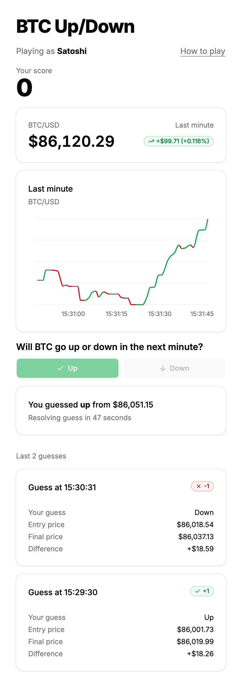

# BTC Up/Down

A web game: guess whether the BTC/USD price will be higher or lower in a minute.

**Play it at https://d2xt4659279tip.cloudfront.net**



## How to play

- Pick an alias.
- Watch the live price and its last-minute chart, then press Up or Down.
- ~60 seconds later, once the price has moved, the guess resolves: +1 if you were right, −1 if not.
- One guess can be open at a time.
- Your score stays with your browser. You can close the tab and come back: an open guess still resolves on time.

## Architecture

- **Frontend:** a static React page on S3 and CloudFront.
- **API:** API Gateway and one Lambda. It fetches the price and the chart's history from Coinbase on request.
- **Guess:** the API sends an SQS message delayed 60 seconds, then saves the guess in DynamoDB.
- **Resolver:** a Lambda triggered by that message. It scores the guess once the price has moved.
- **Infra:** one CDK stack, with no scheduled jobs.

The decisions behind it, and the alternatives we rejected, are in [docs/design.md](docs/design.md).

## Layout

- `backend/`: the API and resolver Lambdas. Pure game rules live in `backend/src/domain`, with their tests.
- `frontend/`: Vite + React single page, styled with Tailwind and shadcn/ui (generated components in `frontend/src/components/ui`).
- `infra/`: the CDK app, one stack in `eu-north-1`.
- `smoke/`: smoke test against the deployed API.

## Local setup

Needs Node 22 (the Lambda runtime) and npm. The backend runs only in AWS, so there's no local server. To try the app, use the live URL above or deploy your own stack.

```sh
git clone https://github.com/jjdinho/epilot-coding-assignment.git
cd epilot-coding-assignment
npm install
```

## Tests

```sh
npm test        # unit tests
npm run build   # typecheck everything and build the frontend
npm run synth   # cdk synth, after npm run build; needs no AWS credentials
```

Unit tests cover the pure rules: player ID, alias and price checks, price staleness, scoring, the chart's history from Coinbase trades, and the client's countdown, chart window, price trend, line colours and guess history. The thin Lambda handlers are covered by the smoke test instead.

## Deploy

Needs an AWS account, and credentials for it in your shell, for example with `AWS_PROFILE`. The stack is called `BtcUpDown`.

Once per account, bootstrap CDK in the region:

```sh
npx cdk bootstrap aws://<account-id>/eu-north-1
```

Then build and deploy:

```sh
npm run deploy
```

IAM changes deploy without a prompt (`requireApproval: never` in `infra/cdk.json`). The first deploy takes about 4 minutes, mostly CloudFront; later ones about a minute. The stack outputs `SiteUrl` (the game) and `ApiUrl`. To read them again:

```sh
aws cloudformation describe-stacks --stack-name BtcUpDown --region eu-north-1 --query 'Stacks[0].Outputs'
```

## Smoke test

Runs against a deployed API:

```sh
API_URL=<ApiUrl> npm run smoke
```

Against the live stack, that's `API_URL=https://d4zs1odcjl.execute-api.eu-north-1.amazonaws.com npm run smoke`.

It plays one new player through the API: the player ID and alias checks, the chart's history, a fresh price, and the guesses the API must refuse. Last, it makes a guess and waits for the resolver to score it, so a run takes a little over a minute. It prints a ✓ per check and stops at the first failure with a ✗ and the assertion. Each run reserves an alias of the form `smoke_xxxxxxxx` for good, as any player does.

## Trade-offs

All trade-off decisions were made to prioritize simplicity and fairness. The design accepts these, for a game this size. The D numbers are the decisions in [docs/design.md](docs/design.md#4-decisions).

- **The server picks the entry price (D4):** it can differ from the price on screen by a second's movement, but no player can spoof it.
- **One delayed SQS message resolves each guess (D5):** if it were lost, the guess would resolve late, on the player's next visit, but nothing runs between guesses, and resiliency can be added later if deemed necessary.
- **The player ID in local storage is the only credential (D6):** a new browser or cleared storage starts a new player at 0, but there's no sign-up.
- **Aliases are unique without sign-in (D9):** a player who clears storage loses theirs for good, but names never clash.
- **The chart's history comes from Coinbase's recent trades (D11):** it can show a price the server never fetched, but it's full on load with nothing stored.
- **Each API instance fetches its own price on demand (D2):** Coinbase calls grow with traffic and the price can briefly step back, but nothing runs while nobody plays.

## What we didn't do

These features were consciously left out. They aren't needed yet, but can be added if the game needs more resiliency, scalability or a better UX. More in [design §9](docs/design.md#9-what-we-didnt-do).

- **Authentication.** Sign-in, such as a Cognito user pool, would keep a player's score across browsers and devices.
- **Alias changes and moderation.** Aliases are fixed once chosen and aren't filtered for offensive words or bulk reservation.
- **A dead-letter queue.** It would set aside a resolver message that keeps failing, instead of retrying it for a long time.
- **A shared price cache, and a cap on the resolver's concurrency.** Both would bound Coinbase calls as traffic grows.
- **A mobile layout.** It would pin the score, price and Up and Down buttons to the bottom of a phone's screen.
- **A leaderboard.** It would rank players' aliases by score, which needs a new index and alias moderation.
